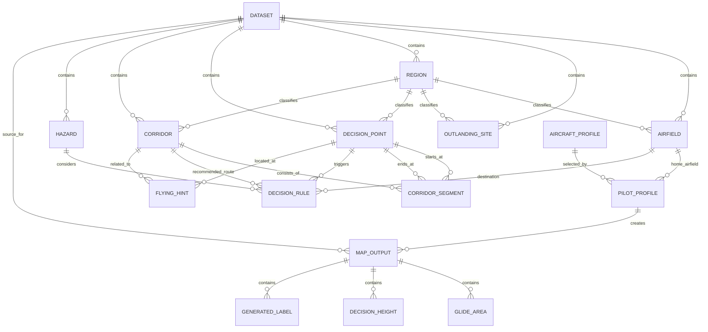

# Data Model 1.0

This document defines the initial data model for OpenGlide Decision Map.

The goal is to separate four concerns:

1. Geography — objective spatial data
2. Knowledge — local flying experience
3. Configuration — pilot and aircraft profiles
4. Generated data — outputs calculated from the first three layers

## Core principle

Store knowledge and geometry.  
Do not store calculated decision heights permanently.

Decision heights are generated from:

```text
pilot profile
+ aircraft profile
+ corridor
+ terrain
+ destination
= decision height
```

## Entity Relationship Diagram



## Tables

### dataset

Regional dataset such as Switzerland, Austria or French Alps.

| Field | Type | Description |
|---|---|---|
| dataset_id | text | Stable ID |
| name | text | Human-readable name |
| country | text | Country or region |
| version | text | Dataset version |
| source | text | Main source |
| license | text | Data license |

### airfields

Airfields and landing sites with operational relevance.

| Field | Type | Description |
|---|---|---|
| airfield_id | text | Stable internal ID |
| icao | text | ICAO code where available |
| name | text | Name |
| type | text | airfield, glider_site, military, heliport |
| elevation_m | integer | Elevation in metres MSL |
| country | text | Country |
| region_id | text | Region reference |
| default_arrival_agl_m | integer | Default arrival height AGL |
| default_glide_ratio | integer | Default decision glide ratio |
| active | boolean | Active yes/no |
| remarks | text | Notes |

Geometry: point.

### outlanding_sites

Potential outlanding fields or known outlanding areas.

| Field | Type | Description |
|---|---|---|
| site_id | text | Stable internal ID |
| name | text | Name |
| region_id | text | Region reference |
| rating | text | P, S, E |
| elevation_m | integer | Elevation in metres MSL |
| surface | text | grass, field, asphalt, unknown |
| length_m | integer | Approximate length |
| width_m | integer | Approximate width |
| status | text | active, check, closed |
| risk | integer | 1 low to 5 high |
| source | text | Source of information |
| last_reviewed | date | Last review date |
| publish | text | public, internal, no |
| remarks | text | Notes |

Geometry: point or polygon later.

### regions

Areas with similar flying assumptions.

| Field | Type | Description |
|---|---|---|
| region_id | text | Stable internal ID |
| name | text | Name |
| default_glide_ratio | integer | Default decision glide ratio |
| terrain_factor | real | Terrain factor, e.g. 0.5 for mountains |
| default_arrival_agl_m | integer | Default arrival margin |
| remarks | text | Notes |

Geometry: polygon.

### decision_points

Locations where a pilot may reasonably choose between two or more strategies.

| Field | Type | Description |
|---|---|---|
| point_id | text | Stable internal ID |
| name | text | Name |
| point_type | text | valley, pass, junction, lake, airfield, ridge, checkpoint |
| region_id | text | Region reference |
| description | text | Short description |
| source | text | Source of knowledge |
| last_reviewed | date | Last review date |

Geometry: point.

### corridors

Preferred flying corridors connecting decision points.

| Field | Type | Description |
|---|---|---|
| corridor_id | text | Stable internal ID |
| name | text | Name |
| corridor_type | text | valley, pass, ridge, direct, transition |
| region_id | text | Region reference |
| priority | integer | 1 high to 5 low |
| direction | text | both, inbound, outbound |
| description | text | Description |
| source | text | Source of knowledge |
| last_reviewed | date | Last review date |

Geometry: line or abstract record. Detailed geometry may be in corridor_segments.

### corridor_segments

Segments of a corridor between two decision points.

| Field | Type | Description |
|---|---|---|
| segment_id | text | Stable internal ID |
| corridor_id | text | Corridor reference |
| start_point_id | text | Start decision point |
| end_point_id | text | End decision point |
| direction | text | both, one_way |
| remarks | text | Notes |

Geometry: line.

### hazards

Flight-relevant hazards or constraints.

| Field | Type | Description |
|---|---|---|
| hazard_id | text | Stable internal ID |
| name | text | Name |
| hazard_type | text | lake, mountain, forest, city, powerline, airspace, lee, terrain |
| severity | text | low, medium, high |
| description | text | Description |
| source | text | Source |
| last_reviewed | date | Last review date |

Geometry: point, line or polygon.

### decision_rules

Local decision knowledge connecting places, destinations, hazards and corridors.

| Field | Type | Description |
|---|---|---|
| rule_id | text | Stable internal ID |
| trigger_point_id | text | Where the rule applies |
| destination_airfield_id | text | Intended destination |
| recommended_corridor_id | text | Recommended corridor |
| hazard_id | text | Related hazard |
| rule_type | text | height, route, avoid, alternate, outlanding |
| priority | text | low, medium, high |
| description | text | Human-readable rule |
| source | text | Source of knowledge |
| last_reviewed | date | Last review date |

No geometry required.

### flying_hints

Short practical notes shown on maps or in training material.

| Field | Type | Description |
|---|---|---|
| hint_id | text | Stable internal ID |
| location_id | text | Optional decision point |
| corridor_id | text | Optional corridor |
| severity | text | info, caution, warning |
| text | text | Hint text |
| source | text | Source |
| last_reviewed | date | Last review date |

No geometry required or linked geometry.

### aircraft_profiles

Aircraft-specific decision values.

| Field | Type | Description |
|---|---|---|
| aircraft_profile_id | text | Stable internal ID |
| aircraft_name | text | Aircraft name |
| aircraft_class | text | club, training, standard, high_performance |
| glide_ratio_nominal | integer | Theoretical glide ratio |
| glide_ratio_mountain | integer | Conservative mountain value |
| glide_ratio_flat | integer | Conservative flatland value |
| remarks | text | Notes |

### pilot_profiles

Personal configuration.

| Field | Type | Description |
|---|---|---|
| profile_id | text | Stable internal ID |
| profile_name | text | Name |
| home_airfield_id | text | Home airfield |
| aircraft_profile_id | text | Aircraft profile |
| glide_ratio_mountain | integer | Personal mountain value |
| glide_ratio_flat | integer | Personal flatland value |
| arrival_home_agl_m | integer | Arrival margin at home |
| arrival_other_agl_m | integer | Arrival margin elsewhere |
| show_outlanding_rating | text | P, S, E filter |
| remarks | text | Notes |

### map_outputs

Generated map products.

| Field | Type | Description |
|---|---|---|
| output_id | text | Stable internal ID |
| profile_id | text | Pilot profile |
| dataset_id | text | Dataset |
| output_type | text | paper, tablet, pdf, flight_card |
| scale | text | e.g. 1:350000 |
| format | text | A1, A4, custom |
| created_at | datetime | Creation timestamp |
| remarks | text | Notes |

### generated_decision_heights

Calculated values, regenerated when profiles or data change.

| Field | Type | Description |
|---|---|---|
| height_id | text | Stable internal ID |
| output_id | text | Map output reference |
| point_id | text | Decision point |
| destination_airfield_id | text | Destination |
| required_altitude_m | integer | Required altitude MSL |
| glide_ratio_used | integer | Glide ratio used |
| reserve_agl_m | integer | Arrival reserve |
| route_used | text | Corridor or route |
| generated_at | datetime | Timestamp |

### generated_glide_areas

Calculated glide areas.

| Field | Type | Description |
|---|---|---|
| area_id | text | Stable internal ID |
| output_id | text | Map output reference |
| destination_airfield_id | text | Destination |
| glide_ratio_used | integer | Glide ratio used |
| reserve_agl_m | integer | Reserve used |
| generated_at | datetime | Timestamp |

Geometry: polygon.

### generated_labels

Calculated labels for print and tablet maps.

| Field | Type | Description |
|---|---|---|
| label_id | text | Stable internal ID |
| output_id | text | Map output |
| label_type | text | height, warning, corridor, airfield |
| text | text | Label text |
| generated_at | datetime | Timestamp |

Geometry: point.
